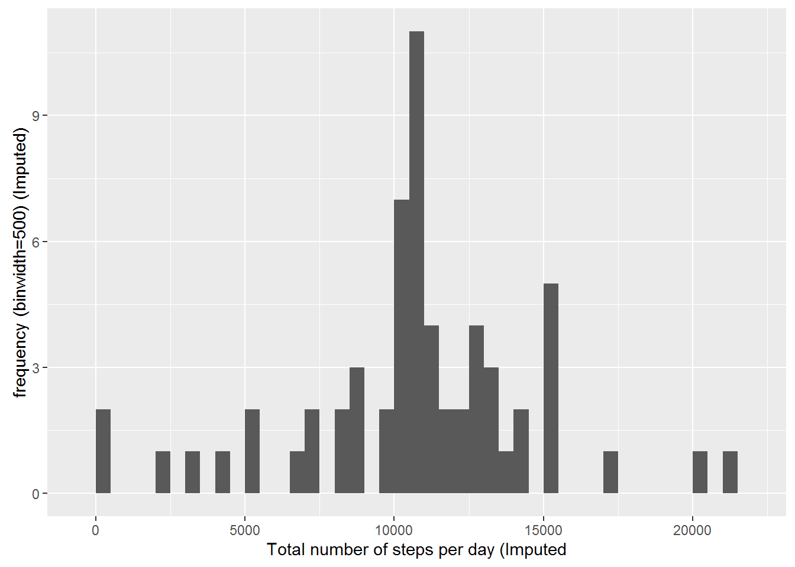

## 1.Loading and preprocessing the data


```r
Data <- read.csv("activity.csv", sep =",")
```

## 2. What is mean total number of steps taken per day?

#### 2.1 Calculate the total number of steps taken per day

```r
library(ggplot2)
StepsByDay <- tapply(Data$steps, Data$date, sum, na.rm=TRUE)
head(StepsByDay)
```

```
## 2012-10-01 2012-10-02 2012-10-03 2012-10-04 2012-10-05 2012-10-06 
##          0        126      11352      12116      13294      15420
```
#### 2.2 Make a histogram of the total number of steps taken each day

```r
qplot(StepsByDay, xlab="Total number of steps per day", ylab="frequency (binwidth=500)", binwidth=500)
```


#### 2.3 Calculate and report the mean and median of the total number of steps taken per day

```r
MeanStepByDay<- mean(StepsByDay)
MedianStepByDay<-median(StepsByDay)
```
The mean is 9354.2295082 and the median is 10395.

##3.What is the average daily activity pattern?

#### 3.1 Make a time series plot of the 5-minute interval (x-axis) and the average number of steps taken, averaged across all days (y-axis)

```r
StepsByInterval <- aggregate (steps~interval, Data, mean, na.rm=TRUE)
g <- ggplot (StepsByInterval, aes(interval, steps))
g+geom_line() + labs (x= "5 minutes interval", y="Average number of steps")
```


#### 3.2 Which 5-minute interval, on average across all the days in the dataset, contains the maximum number of steps?

```r
StepsByInterval[which.max(StepsByInterval$steps),]
```

```
##     interval    steps
## 104      835 206.1698
```

##4 Imputing missing values

#### 4.1 Calculate and report the total number of missing values in the dataset

```r
Miss <- sum(is.na(Data$steps))
```
The total number of missing values is 2304.
#### 4.2 Devise a strategy for filling in all of the missing values in the dataset.

```r
library(Hmisc)
```
#### 4.3 Create a new dataset that is equal to the original dataset but with the missing data filled in.

```r
head(Data)
```

```
##   steps       date interval
## 1    NA 2012-10-01        0
## 2    NA 2012-10-01        5
## 3    NA 2012-10-01       10
## 4    NA 2012-10-01       15
## 5    NA 2012-10-01       20
## 6    NA 2012-10-01       25
```

```r
DataImputed <- Data
DataImputed$steps <- impute(Data$steps, fun=mean)
head(DataImputed)
```

```
##     steps       date interval
## 1 37.3826 2012-10-01        0
## 2 37.3826 2012-10-01        5
## 3 37.3826 2012-10-01       10
## 4 37.3826 2012-10-01       15
## 5 37.3826 2012-10-01       20
## 6 37.3826 2012-10-01       25
```
#### 4.4 Make a histogram of the total number of steps taken each day and Calculate and report the mean and median total number of steps taken per day. 

```r
StepsByDayImputed <- tapply(DataImputed$steps, DataImputed$date, sum)
qplot(StepsByDayImputed, xlab="Total number of steps per day (Imputed", 
      ylab="frequency (binwidth=500) (Imputed)", binwidth=500)
```



Do these values differ from the estimates from the first part of the assignment? 

```r
MeanStepByDayImputed <- mean(StepsByDayImputed)
MedianStepByDayImputed <- median(StepsByDayImputed)
DiffMean <- MeanStepByDayImputed - MeanStepByDay
DiffMedian <- MedianStepByDayImputed - MedianStepByDay
DiffMean
```

```
## [1] 1411.959
```

```r
DiffMedian
```

```
## [1] 371.1887
```
Yes, they differ. 
What is the impact of imputing missing data on the estimates of the total daily number of steps?

```r
DiffSteps <- sum(DataImputed$steps) - sum(Data$steps, na.rm=TRUE)
DiffSteps
```

```
## [1] 86129.51
```
The total number of steps is higer when the missing data are filled in.

##5.Are there differences in activity patterns between weekdays and weekends?

#### 5.1 Create a new factor variable in the dataset with two levels - "weekday" and "weekend" indicating whether a given date is a weekday or weekend day.

```r
DataImputed$Week <- ifelse(as.POSIXlt(DataImputed$date)$wday %in% c(0,6), 'weekend', 'weekday')
```
#### 5.2 Make a panel plot containing a time series plot (i.e. type = "l") of the 5-minute interval (x-axis) and the average number of steps taken, averaged across all weekday days or weekend days (y-axis).

```r
StepsByIntervalWeek <- aggregate(steps~interval+Week, DataImputed, mean)
g <- ggplot (StepsByIntervalWeek, aes(interval,steps))
g + geom_line()+ facet_grid(Week ~.) + labs (x<- "5 minutes iterval", 
                                             y="Average number of steps (imputed)")
```


```r
output: 
        html_document:
        keep_md: true
```

```
## Error in eval(expr, envir, enclos): object 'output' not found
```
